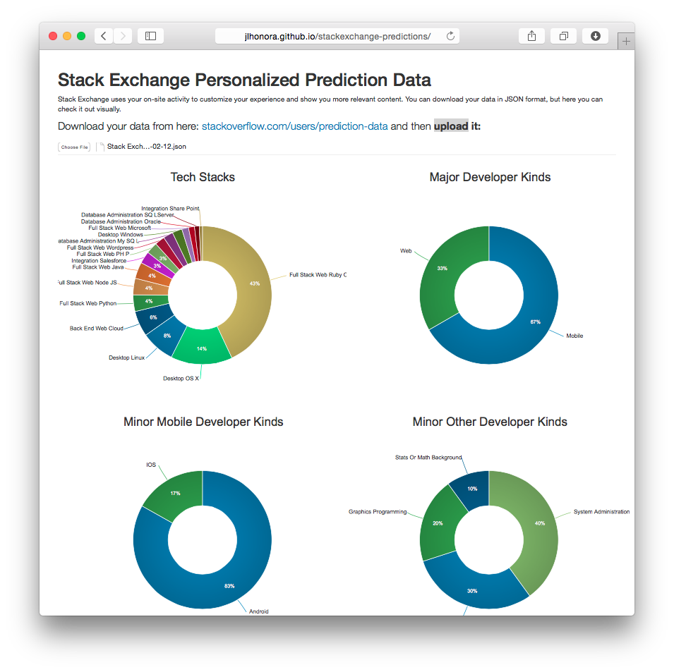

Stack Exchange Personalized Prediction Data
===========================================

Stack Exchange uses your on-site activity to customize your experience and show you more relevant content. You can download your data in JSON format, and with this repo you can check it out visually.

This is the repo page, go [here](jlhonora.github.io/stackexchange-predictions) if you want to see it in action.

Here's my data, for example:

## TODO

- Visual rework
- Add top 10 tags
